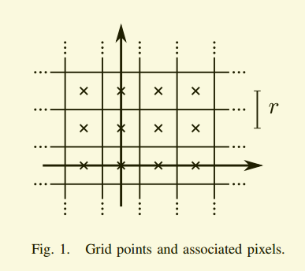
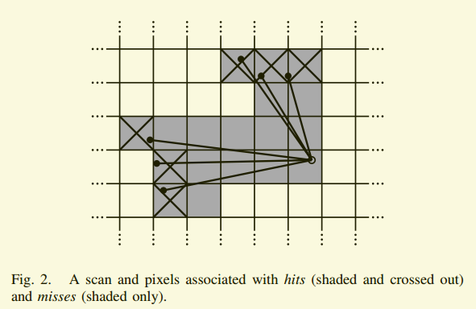
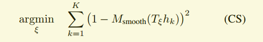
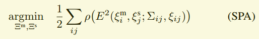
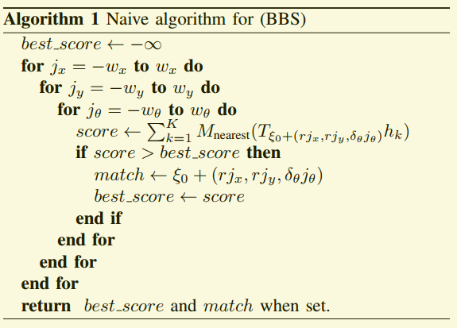

# Read-Time Loop Closure in 2D LIDIR SLAM 论文的中文翻译

> 摘要：通过激光雷达进行同步定位与测绘(SLAM)是一种获取环境地图的有效方法。实时生成和可视化楼层平面图有助于操作员评估捕获数据的质量和覆盖范围。构建便携式捕获平台需要在有限的计算资源下运行。我们介绍了使用的方法在我们的背包地图平台，实现实时构图并做闭环检测优化(5厘米分辨率)。为了实现实时闭环，我们使用了分支界限法去计算 scan to submap 的约束。并做了实验比较。

## 1 介绍

　　建筑平面图在很多应用中很有用。为建筑管理任务收集这些数据的手工调查通常结合计算机辅助设计(CAD)和激光磁带测量。这些方法很慢，而且由于人类先入为主地认为建筑是直线的集合，因此并不总是能准确地描述空间的真实性质。使用SLAM，可以快速、准确地测量建筑物的大小和复杂程度，而手工测量则需要多几个数量级的时间。

　　在这一领域中应用SLAM并不是一个新的概念，也不是本文的重点。相反，本文的贡献是一种新的方法，减少了从激光距离数据计算环路闭合约束的计算要求。这种技术使我们能够绘制非常大的楼层图，数万平方米，同时为操作员提供实时的完全优化的结果。

## 2 相关工作
　　scan_to_scan 是激光SLAM方法中计算相对位置变化的常用方法，如[1]-[4]。然而，单凭  scan_to_scan 就会很快累计误差。

　　scan_to_map 有助于限制这种累计误差。其中一种方法是[5]，它使用高斯-牛顿法在线性插值的地图上找到局部最优解。在使用足够高的数据速率激光雷达提供良好的姿态初始估计的情况下，局部优化 scan_to_map 是有效并具有鲁棒性的。在不稳定平台上，利用惯性测量单元(IMU)去估计重力方向。

　　像素精确的扫描匹配的方法，如[1]，进一步减少了局部误差积累。计算上比较昂贵，但这种方法在闭环优化方面是很有效的。一些方法侧重于通过一部分计算代价从激光扫描中提取的特征[4]。闭环检测的其他方法包括基于直方图的匹配[6]、扫描数据的特征提取和使用机器学习[7]。

　　处理残留的局部误差积累的两种常用方法是粒子滤波和基于图的SLAM[2]、[8]。

　　粒子过滤器必须在每个粒子中维护完整系统状态的表示。对于基于网格的SLAM，随着地图变大，这很快就会成为资源密集型;例如，我们的一个测试用例是在3公里的轨道上收集22000平方米。更小的维度特征表示，例如[9]，它不需要为每个粒子提供网格映射，可以用于减少资源需求。当需要一个最新的网格地图时，[10]建议只计算必须要更新的子图，一张张子图拼起来组成最后的地图。

　　基于图的方法在表示姿态和特性的节点集合上工作。图中的边是由观察产生的约束。可以使用各种优化方法来最小化所有约束带来的误差，如[11]、[12]。该户外SLAM系统采用基于图的方法，局部的 scan_to_scan，以及基于子地图特征直方图的重叠局部地图匹配[13]。

## 3 系统概述
　　谷歌的制图师提供了一个实时构建室内地图的解决方案，用一个配备传感器的背包，可以生成分辨率为 $ r = 5cm$ 的二维网格地图。该系统的操作人员可以通过行走看到正在创建的地图。激光扫描的数据会插入子图中最佳估计位置，该位置假定在短时间内足够精确。扫描匹配是针对当前时刻的子图进行的，因此它只依赖于当前的扫描，并且世界帧中姿态估计的误差会累积。

　　为达到良好的性能与适度的硬件要求，我们的SLAM方法不采用粒子滤波。为了应对误差的累积，我们定期进行位姿优化。当一个子图完成时，它将不再插入新的扫描数据，它会成为闭环检测扫描匹配的一部分。有子图完成将自动考虑闭环检测。如果根据当前的位姿估计距离足够近，扫描匹配器就会尝试在子图中找到扫描。如果在当前预估位姿周围的搜索窗口中找到足够好的匹配项，则将其作为循环关闭约束添加到优化问题。通过每隔几秒钟完成一次优化，操作员的经验是，当某个位置被重新访问时，循环会立即关闭。这导致了软实时约束，即循环关闭扫描匹配必须比添加新扫描更快地进行，否则会明显落后。我们通过使用分支界定方法和每个完成的子图的几个预计算网格来实现这一点。

## 4 局部 2D SLAM
　　我们的系统结合了独立的本地和全局方法来实现2D SLAM。两种方法都优化了通过激光雷达扫描下的计算出的位姿pose，$ξ= (ξx，ξy，ξθ)$ 由平移位置 $(x, y)$ 和旋转角度 $ξ_{θ}$ 组成。在一个不稳定的平台上，比如我们的背包，IMU被用来估计重力的方向，提供给水平安装的2D激光雷达。

　　在我们的局部方法中，每个连续扫描都与世界的一小块区域匹配，称为子图 $M$ ，使用非线性优化将扫描与子图对齐；这个过程进一步称为扫描匹配。它的误差会随着时间累积，稍后我们的全局方法会消除这些误差，如第五节所述。

### 4.1 Scans (扫描)
　　子地图的构建是扫描与子地图坐标系反复对齐的迭代过程，又称帧。当扫描原点 $O∈R^{2} $时，我们将扫描点的集合记为 $H=$ { $h_{k}$ }  $_{k=1，…，K}, h_{k}∈R^{2}$。$p:$ 激光击打到的point (测量点)， $$ ξ T_{ξ}:$$  旋转矩阵，以下公式作用：将激光测量点转化到绝对坐标系下。

.png)

### 4.2 Submaps (子图)

　　使用一帧帧激光扫描数据来构建子图。这些子映射采用概率栅格M的形式$M: rZ×rZ→[pmin, pmax] $，为分辨率为5cm的栅格。对于每块栅格区，它都有一个概率值，由打在相应栅格里的激光点数量决定。



　　当激光扫描数据插入概率栅格时，计算命中的一组栅格点和未命中的一组不相交栅格点。对于每次命中，我们都将最近的栅格点插入命中集。对于每一个缺失，我们插入与每个像素相关联的网格点，每个像素点与扫描原点和每个扫描点之间的一条射线相交，不包括已经在命中集中的网格点。每个以前未观测到的网格点都被分配一个概率$p_{hit}$或$p_{miss}$，如果它在这些集合中。如果已经观察到网格点$x$，则将命中和未命中的概率更新为
　      　(3).png)

对于未击中的也是如此； (注：障碍区越来越黑，无障碍区越来越白)

[栅格地图参考](https://zhuanlan.zhihu.com/p/21738718)

​                 

### 4.3 Ceres scan maching 

　　在将激光扫描数据插入子图之前，激光姿态 $$ξ$$ 相对于当前子图会使用基于Ceres -[14]的扫描匹配器进行优化。扫描匹配器负责找到一个最优 (最大概率) 姿态。我们把它转换成一个非线性最小二乘问题。

​                        

$$T_{ξ}$$ 将 $$h_{k}$$ 转化到子图坐标系下。函数$$Msmooth: R2→R$$ 是对子图 (概率) 进行平滑滤波处理的一种方式。我们使用的是双三次插值法。因此，间隔[0,1]之外的值可以出现，但是没有影响。

　　这种平滑函数的数学优化通常比网格的分辨率精度更高。由于这是一个局部优化，所以需要好的初始估计。IMU (惯性测量单元) 可以通过测量角速度来估计旋转量 $$θ$$ 。在没有IMU的情况下，可以使用更高的扫描匹配频率或精准像素的扫描匹配方法，但是计算量会很大。

## 5 闭环检测

　　因为激光最近一段时间几次的扫描都用只是来匹配跟新当前的子图，因此误差会慢慢累积。只有几十次连续扫描，累积误差才会很小。

　　大的场景应该创建许多小子图。我们的方法将优化所有扫描数据和子图，通过稀疏位姿调整[2]。激光扫描出的相对位置将被存储在内存中，以便在闭环优化中使用。除了这些相对的姿态外，一旦子图不再变化，所有的扫描数据组成的对和子图都将被考虑用于闭环优化。在后台运行扫描匹配器，如果有好的匹配，则将相应的相对位姿添加到优化问题中。

#### A. 优化问题

　　与扫描匹配一样，闭环优化也被表述为一个非线性最小二乘问题，它很容易根据残差来考虑额外的数据。每隔几秒钟，我们就使用Ceres[14]来计算



子图的位置 $$Ξm = $${ $$ξ_{i}$$ }$$ =1,…,m$$ 和扫描 $$Ξs = $$ { $$ξ_{j}$$ }$$ = 1,……,n; $$ 在世界范围内优化给出了一些约束条件。这些约束采取相对位姿 $$ξ_{ij}$$ 和相关的协方差矩阵 $$Σ_{ij}$$ 组成。对于一对 子图 $$ i $$ (一个) 和扫描 $$j$$ (一帧)， 用 $$ξ_{ij}$$ 来描述子图中扫描匹配出的位姿。用$$Σ_{ij}$$ 来描述协方差，例如方法[15]，或在本地使用的协方差估计 Ceres (CS) [14]。该约束的残差 $$E$$ 可以通过以下公式计算:

(5).png)

　　损失函数 $$ρ$$ ，例如 $$Huber$$ 损失，当在优化问题中扫描匹配出不正确约束时，用来降低异常值在 (SPA) 中的影响。例如，这可能发生在局部对称的环境中，例如办公室隔间。异常值的替代方法包括[16]。

#### B. 分支定界扫描匹配
　　我们感兴趣的 最优的，像素精确的匹配其中 $$W$$ 为搜索窗口，其中 $$Mnearest$$ 为 $$M$$，首先将其自变量四舍五入到最近的网格点，将 $$M$$ 扩展到整个 $$R2$$，即将一个网格点的值扩展到相应的像素点。使用CS可以进一步提高比赛的质量。

.png)

　　通过有效的步长选择，可以提高效率。我们选择角步长 $$δ_{θ}$$ 以便扫描点的最大射程距离不超过 $$r$$ 移动，一个像素的宽度。利用余弦定理，我们得到：

(7).png)

　　我们计算包含给定线性和角搜索窗口大小的整数步数，$$W_{x} =W_{y}= 7 m$$ 并且 $$W_{θ}= 30$$，

.png)

　　这导致一个有限集 $$W$$ 周围形成一个搜索窗估计 $$ξ_{0}$$ 放置在它的中心，

(10).png)

一个可用的算法用于找到 $$ξ$$ 可以很容易地制定，见算法1，但对于搜索窗口大小，我们觉得它太慢了。



## 6 实验结果

## 7 总结
　　本文提出并实验验证了一个二维SLAM系统，该系统将 scan_to_map 与闭环检测和图优化相结合。使用我们本地的、基于网格的SLAM方法创建轨迹。在后台，所有的扫描都被匹配到附近的子映射，使用像素精确的扫描匹配来创建循环闭合约束。在此背景下，对子图和扫描位姿的约束图进行了周期性的优化。这个操作将以gpu加速的方式将完成的子图和当前子图组合在一起，得到最终的地图。我们证明了在适当的硬件上实时运行我们的算法是可能的。

- 参考引用
```
[1] 
[2]
```
